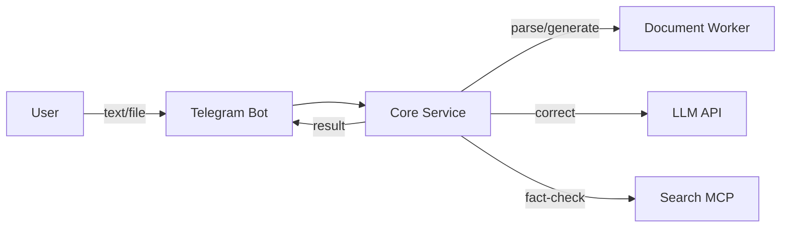
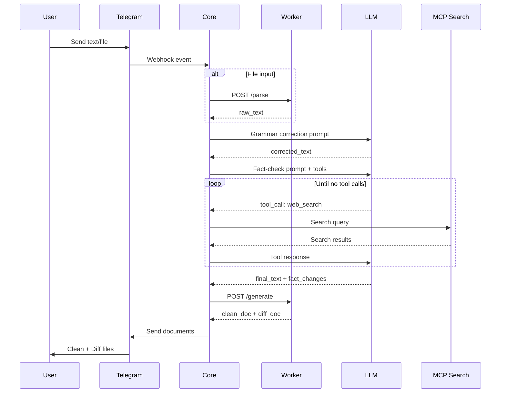

# Red Pen (Красная Ручка) - Technical Specification

## 1. Overview

AI-powered text editor for Russian language: grammar correction + fact-checking without rewriting.

**Output:** Two documents per request:
- **Clean copy** - ready-to-use corrected text
- **Diff log** - visual changelog with color-coded edits



---

## 2. Architecture

### Services

| Service | Stack | Role |
|---------|-------|------|
| **Core** | Bun + TypeScript + Hono | Orchestrator: Telegram, LLM, MCP, business logic |
| **Worker** | Python 3.11 + FastAPI | Document parsing and diff generation |

### External Dependencies

- **LLM**: OpenAI-compatible API (custom URL)
- **MCP**: Search tools (Exa/Tavily/Google)
- **Storage**: Redis or SQLite (sessions, user dictionaries)
- **Telegram**: Grammy library

---

## 3. Data Models

### 3.1 Core Service Entities

```typescript
// User session and preferences
interface User {
  telegramId: number;
  globalPrompt?: string;        // custom instructions
  dictionary: string[];         // words to ignore (names, slang)
  createdAt: Date;
}

// Processing job
interface Job {
  id: string;                   // uuid
  userId: number;
  status: 'pending' | 'parsing' | 'correcting' | 'fact_checking' | 'generating' | 'done' | 'error';
  inputType: 'text' | 'file';
  inputFormat?: 'docx' | 'doc' | 'txt' | 'md' | 'pdf';
  originalText: string;
  correctedText?: string;
  factChanges?: FactChange[];
  error?: string;
  createdAt: Date;
  completedAt?: Date;
}

// Fact-check correction
interface FactChange {
  original: string;             // "Дональд Трамп"
  corrected: string;            // "Илон Маск"
  context: string;              // "Глава Tesla"
  source?: string;              // search result URL
}
```

### 3.2 Worker Service Models

```python
from pydantic import BaseModel
from typing import Literal

class ParseRequest(BaseModel):
    file_content: bytes  # base64 encoded
    file_type: Literal["docx", "doc", "pdf", "txt", "md"]

class ParseResponse(BaseModel):
    text: str
    error: str | None = None

class DiffRequest(BaseModel):
    original: str
    corrected: str
    fact_changes: list[dict] | None = None  # [{original, corrected, context}]

class DiffResponse(BaseModel):
    clean_doc: bytes   # base64 encoded docx
    diff_doc: bytes    # base64 encoded docx
    error: str | None = None
```

---

## 4. API Contracts

### 4.1 Worker API (Python FastAPI)

#### POST /parse
Extract text from uploaded file.

```json
// Request
{
  "file_content": "base64...",
  "file_type": "docx"
}

// Response 200
{
  "text": "Extracted plain text...",
  "error": null
}

// Response 400
{
  "text": "",
  "error": "Unsupported file format"
}
```

#### POST /generate
Generate clean and diff documents.

```json
// Request
{
  "original": "Глава Tesla Дональд Трамп объявил...",
  "corrected": "Глава Tesla Илон Маск объявил...",
  "fact_changes": [
    {
      "original": "Дональд Трамп",
      "corrected": "Илон Маск",
      "context": "Глава Tesla"
    }
  ]
}

// Response 200
{
  "clean_doc": "base64...",
  "diff_doc": "base64...",
  "error": null
}
```

### 4.2 LLM Integration (OpenAI-compatible)

```typescript
interface LLMConfig {
  baseUrl: string;      // custom endpoint
  model: string;
  apiKey?: string;
}

// Tool definition for fact-checking
const webSearchTool = {
  type: "function",
  function: {
    name: "web_search",
    description: "Search web for fact verification",
    parameters: {
      type: "object",
      properties: {
        query: { type: "string", description: "Search query" }
      },
      required: ["query"]
    }
  }
};
```

---

## 5. Processing Pipeline



---

## 6. User Stories

### US-001: Text Message Correction
```
As a user,
I send a text message to the bot,
So I receive corrected text + diff file.

Acceptance:
- [x] Bot accepts plain text messages
- [x] Returns corrected text as message
- [x] Attaches diff.docx with visual changes
- [x] Preserves author's style (no rewriting)
```

### US-002: Document Correction
```
As a user,
I send a .docx/.pdf file to the bot,
So I receive two files: clean and diff versions.

Acceptance:
- [x] Supports: docx, doc, txt, md, pdf
- [x] Returns clean.docx (corrected)
- [x] Returns diff.docx (with markup)
- [x] Original formatting preserved where possible
```

### US-003: Custom Dictionary
```
As a user,
I configure my dictionary (names, terms),
So the bot doesn't "correct" valid words.

Acceptance:
- [x] /dictionary command to manage words
- [x] Words in dictionary are never corrected
- [x] Persists across sessions
```

### US-004: Global Prompt
```
As a user,
I set custom instructions (global prompt),
So corrections follow my preferences.

Acceptance:
- [x] /settings command to set prompt
- [x] Prompt included in every LLM request
- [x] Example: "Всегда используй ё"
```

---

## 7. Diff Visualization Rules

### Color Legend
| Color | Meaning | Style |
|-------|---------|-------|
| Green | Added text | Highlight + text color |
| Red | Deleted text | Strikethrough + text color |
| Orange | Fact correction | Highlight (replaced entity) |

### Diff Algorithm
- Word-level comparison (not character-level for readability)
- Whitespace changes shown with `␣` symbol
- Paragraph structure preserved
- Fact corrections annotated separately

---

## 8. Environment Configuration

```bash
# Core Service
TG_TOKEN=telegram_bot_token
LLM_BASE_URL=http://my-llm:8000/v1
LLM_MODEL=model-name
LLM_API_KEY=optional_key
WORKER_URL=http://doc-worker:8000
REDIS_URL=redis://redis:6379

# Worker Service
# No external config needed
```

---

## 9. Docker Compose

```yaml
services:
  core:
    build: ./core
    environment:
      - TG_TOKEN
      - LLM_BASE_URL
      - LLM_MODEL
      - WORKER_URL=http://worker:8000
      - REDIS_URL=redis://redis:6379
    depends_on:
      - worker
      - redis
    ports:
      - "3000:3000"

  worker:
    build: ./worker
    expose:
      - "8000"

  redis:
    image: redis:alpine
    volumes:
      - redis_data:/data

volumes:
  redis_data:
```

---

## 10. Edge Cases

| Case | Handling |
|------|----------|
| Empty file | Return error: "File is empty" |
| Unsupported format | Return error: "Format not supported" |
| LLM timeout | Retry 2x, then error message |
| MCP search fails | Continue without fact-check, warn user |
| Very long text | Split into chunks, process sequentially |
| No changes needed | Return original + message "No corrections" |
| Corrupted file | Return error: "Cannot parse file" |

---

## 11. Open Questions

1. **Chunk size for long texts** - What's the max tokens per LLM request?
2. **Rate limiting** - Limits per user per day?
3. **File size limit** - Max MB for uploaded files?
4. **Fact-check depth** - How many search queries per document?
5. **History** - Store previous corrections for user reference?
